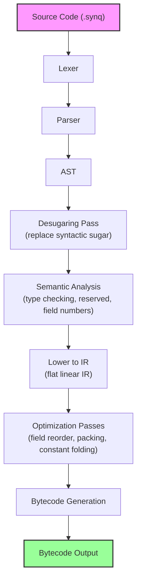

```mermaid
flowchart TD
    A["Source Code (.synq)"] --> B[Lexer]
    B --> C[Parser]
    C --> D[AST]
    D --> E["Desugaring Pass<br/>(replace syntactic sugar)"]
    E --> F["Semantic Analysis<br/>(type checking, reserved, field numbers)"]
    F --> G["Lower to IR<br/>(flat linear IR)"]
    G --> H["Optimization Passes<br/>(field reorder, packing, constant folding)"]
    H --> I[Bytecode Generation]
    I --> J[Bytecode Output]

    style A fill:#f9f,stroke:#333,stroke-width:2px
    style J fill:#9f9,stroke:#333,stroke-width:2px
```
